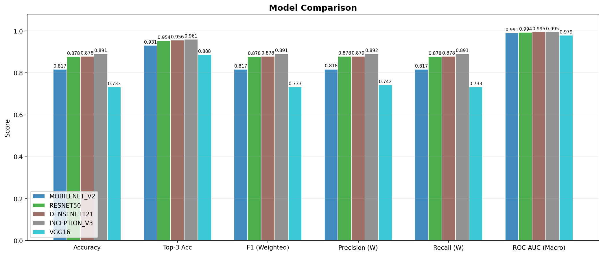
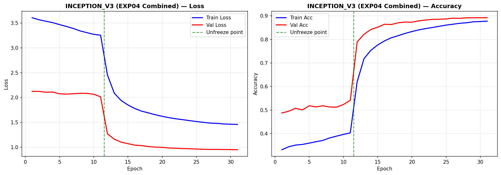
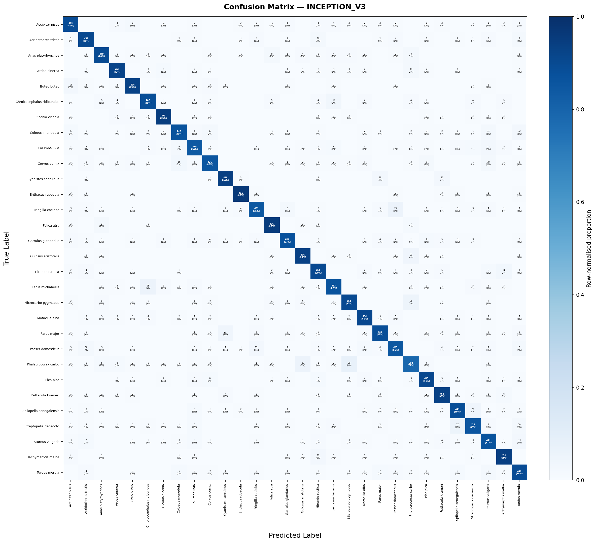
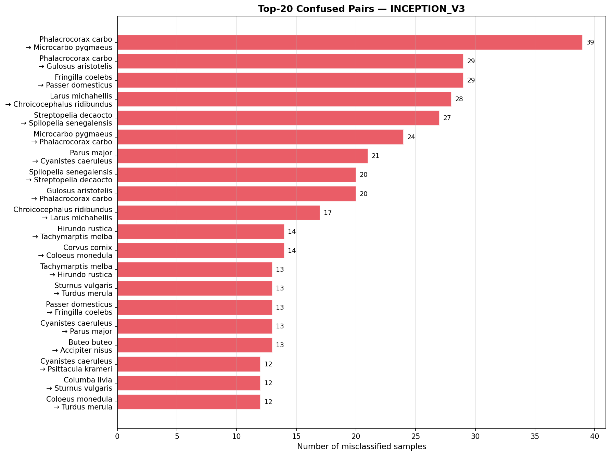

# Bird Species Classification - Machine Learning

A deep learning image classification system for identifying bird species commonly observed in Turkey/Istanbul. Five CNN architectures were compared on a 23-species dataset (5,000 images each). InceptionV3 was selected as the best performer (89.1% accuracy), then fine-tuned through targeted experiments. The dataset was expanded to 30 species (150,000 total images) and the final model achieved **89.3% accuracy** with **96.0% top-3 accuracy**.

---

## Table of Contents

- [Tech Stack](#tech-stack)
- [Dataset](#dataset)
- [Model Benchmarking (23 Species)](#model-benchmarking-23-species)
- [Experiments & Fine-Tuning](#experiments--fine-tuning)
- [Final Model (30 Species)](#final-model-30-species)
- [Per-Class Performance](#per-class-performance)
- [Project Structure](#project-structure)

---

## Tech Stack

| Component         | Detail                                                 |
|-------------------|--------------------------------------------------------|
| **Language**      | Python 3.12                                            |
| **Framework**     | PyTorch 2.5.1 (CUDA 12.1)                              |
| **Key Libraries** | torchvision, scikit-learn, matplotlib, pandas, Pillow  |
| **Models**        | InceptionV3, ResNet50, DenseNet121, MobileNetV2, VGG16 |
| **Data Source**   | [GBIF](https://www.gbif.org/)                          |
| **Environment**   | Miniconda                                              |
| **Hardware**      | NVIDIA RTX 4050 (laptop)                               |

---

## Dataset

| Detail                    | Value                          |
|---------------------------|--------------------------------|
| **Source**                | [GBIF](https://www.gbif.org/)  |
| **Images per species**    | 5,000                          |
| **Split**                 | 80% train · 10% val · 10% test |
| **Initial species count** | 23                             |
| **Final species count**   | 30                             |

Image links were retrieved via GBIF and downloaded to Google Drive. All images were preprocessed to a consistent resolution before training.

<details>
<summary><strong>30 Species</strong></summary>

| #  | Scientific Name            | Common Name            |
|:--:|----------------------------|------------------------|
| 1  | Accipiter nisus            | Eurasian Sparrowhawk   |
| 2  | Acridotheres tristis       | Common Myna            |
| 3  | Anas platyrhynchos         | Mallard                |
| 4  | Ardea cinerea              | Grey Heron             |
| 5  | Buteo buteo                | Common Buzzard         |
| 6  | Chroicocephalus ridibundus | Black-headed Gull      |
| 7  | Ciconia ciconia            | White Stork            |
| 8  | Coloeus monedula           | Western Jackdaw        |
| 9  | Columba livia              | Rock Dove              |
| 10 | Corvus cornix              | Hooded Crow            |
| 11 | Cyanistes caeruleus        | Eurasian Blue Tit      |
| 12 | Erithacus rubecula         | European Robin         |
| 13 | Fringilla coelebs          | Common Chaffinch       |
| 14 | Fulica atra                | Eurasian Coot          |
| 15 | Garrulus glandarius        | Eurasian Jay           |
| 16 | Gulosus aristotelis        | European Shag          |
| 17 | Hirundo rustica            | Barn Swallow           |
| 18 | Larus michahellis          | Yellow-legged Gull     |
| 19 | Microcarbo pygmaeus        | Pygmy Cormorant        |
| 20 | Motacilla alba             | White Wagtail          |
| 21 | Parus major                | Great Tit              |
| 22 | Passer domesticus          | House Sparrow          |
| 23 | Phalacrocorax carbo        | Great Cormorant        |
| 24 | Pica pica                  | Eurasian Magpie        |
| 25 | Psittacula krameri         | Rose-ringed Parakeet   |
| 26 | Spilopelia senegalensis    | Laughing Dove          |
| 27 | Streptopelia decaocto      | Eurasian Collared Dove |
| 28 | Sturnus vulgaris           | Common Starling        |
| 29 | Tachymarptis melba         | Alpine Swift           |
| 30 | Turdus merula              | Common Blackbird       |

</details>

---

## Model Benchmarking (23 Species)

Five architectures frequently used in fine-grained image classification literature were trained and evaluated under identical conditions:

| Model           |  Accuracy  | Top-3 Acc  | Top-5 Acc  | F1 Score  |  ROC AUC  |
|-----------------|:----------:|:----------:|:----------:|:---------:|:---------:|
| **InceptionV3** | **89.10%** | **96.07%** | **97.82%** | **0.891** | **0.995** |
| DenseNet121     |   87.84%   |   95.64%   |   97.64%   |   0.878   |   0.995   |
| ResNet50        |   87.79%   |   95.37%   |   97.60%   |   0.878   |   0.994   |
| MobileNetV2     |   81.73%   |   93.14%   |   96.27%   |   0.817   |   0.991   |
| VGG16           |   73.32%   |   88.77%   |   93.27%   |   0.733   |   0.979   |

<p align="center">
  
</p>
<p align="center"><em>Figure 1 - Performance metrics across five benchmark architectures.</em></p>

**Key takeaways:**
- **InceptionV3** consistently outperformed all other models and was selected for further optimization.
- ResNet50 and DenseNet121 performed nearly identically, trailing InceptionV3 by ~1.3%.
- MobileNetV2 delivered reasonable accuracy with a much smaller footprint.
- VGG16 lagged significantly behind all other architectures.

---

## Experiments & Fine-Tuning

Three experiments were conducted to push InceptionV3's performance further, followed by a combined run incorporating the best findings.

### Exp 1 — Label Smoothing

Applied label smoothing of **0.1** to reduce overconfidence in predictions.

| Metric         | Baseline | Exp 1  |
|----------------|:--------:|:------:|
| Test Accuracy  |  89.10%  | 89.49% |
| Top-5 Accuracy |  97.82%  | 97.63% |
| F1 Score       |  0.891   | 0.895  |

> Marginal improvement. Label smoothing slightly improved calibration but did not meaningfully boost accuracy.

### Exp 2 — Enhanced Augmentation

Heavier data augmentation (additional rotation, color jitter, etc.) was applied during training.

| Metric         | Baseline |   Exp 2    |
|----------------|:--------:|:----------:|
| Test Accuracy  |  89.10%  | **89.64%** |
| Top-5 Accuracy |  97.82%  | **98.03%** |
| F1 Score       |  0.891   | **0.897**  |

> Best single-experiment gain - roughly **+0.5%** accuracy improvement.

### Exp 3 — Freeze Epoch Tuning

Different numbers of frozen backbone epochs were tested before full fine-tuning.

| Freeze Epochs | Best Val Accuracy | Training Time |
|:-------------:|:-----------------:|:-------------:|
|    **11**     |    **89.67%**     |    310 min    |
|      13       |      89.46%       |    293 min    |
|       7       |      89.31%       |    261 min    |
|       9       |      89.13%       |    316 min    |

> **11 freeze epochs** yielded the best validation accuracy.

### Exp 4 — Combined

All improvements merged into a single training configuration:

| Config          | Value            |
|-----------------|------------------|
| Label Smoothing | 0.1              |
| Augmentation    | Enhanced (Exp 2) |
| Freeze Epochs   | 11               |
| Total Epochs    | 31               |

| Metric         | Result |
|----------------|:------:|
| Val Accuracy   | 90.28% |
| Test Accuracy  | 89.50% |
| Top-5 Accuracy | 97.94% |
| F1 Score       | 0.895  |

The combined configuration was adopted as the **final training script** for scaling to the full 30-species dataset.

---

## Final Model (30 Species)

The combined training script was applied to the expanded 30-species dataset. Despite the increased classification difficulty, performance remained strong:

| Metric               |   Score    |
|----------------------|:----------:|
| **Accuracy**         | **89.35%** |
| Top-3 Accuracy       |   95.98%   |
| Top-5 Accuracy       |   97.80%   |
| Precision (weighted) |   0.894    |
| Recall (weighted)    |   0.893    |
| F1 Score (weighted)  |   0.893    |
| ROC AUC (macro)      |   0.996    |
| mAP                  |   0.952    |

<p align="center">
  
</p>
<p align="center"><em>Figure 2 - Validation accuracy over training epochs (30-species final model).</em></p>

<p align="center">
  
</p>
<p align="center"><em>Figure 3 - Confusion matrix for the final 30-species InceptionV3 model.</em></p>

<p align="center">
  
</p>
<p align="center"><em>Figure 4 - Most common misclassification pairs.</em></p>

---

## Per-Class Performance

<details>
<summary><strong>Click to expand full per-class results (30 species)</strong></summary>

| Species                    | Accuracy  | Precision | Recall | F1 Score |
|----------------------------|:---------:|:---------:|:------:|:--------:|
| Erithacus rubecula         | **96.2%** |   0.968   | 0.962  |  0.965   |
| Fulica atra                | **95.2%** |   0.941   | 0.952  |  0.946   |
| Ciconia ciconia            | **94.6%** |   0.940   | 0.946  |  0.943   |
| Tachymarptis melba         |   94.0%   |   0.909   | 0.940  |  0.924   |
| Cyanistes caeruleus        |   93.8%   |   0.934   | 0.938  |  0.936   |
| Gulosus aristotelis        |   93.2%   |   0.901   | 0.932  |  0.916   |
| Psittacula krameri         |   93.0%   |   0.894   | 0.930  |  0.912   |
| Buteo buteo                |   92.8%   |   0.922   | 0.928  |  0.925   |
| Ardea cinerea              |   91.8%   |   0.931   | 0.918  |  0.924   |
| Pica pica                  |   91.0%   |   0.897   | 0.910  |  0.904   |
| Motacilla alba             |   90.8%   |   0.906   | 0.908  |  0.907   |
| Acridotheres tristis       |   90.4%   |   0.888   | 0.904  |  0.896   |
| Hirundo rustica            |   90.2%   |   0.829   | 0.902  |  0.864   |
| Microcarbo pygmaeus        |   90.2%   |   0.872   | 0.902  |  0.887   |
| Anas platyrhynchos         |   89.8%   |   0.907   | 0.898  |  0.903   |
| Turdus merula              |   89.2%   |   0.845   | 0.892  |  0.868   |
| Accipiter nisus            |   88.8%   |   0.884   | 0.888  |  0.886   |
| Spilopelia senegalensis    |   88.6%   |   0.879   | 0.886  |  0.882   |
| Parus major                |   88.6%   |   0.900   | 0.886  |  0.893   |
| Chroicocephalus ridibundus |   88.4%   |   0.891   | 0.884  |  0.888   |
| Garrulus glandarius        |   87.4%   |   0.924   | 0.874  |  0.898   |
| Larus michahellis          |   86.6%   |   0.893   | 0.866  |  0.879   |
| Sturnus vulgaris           |   86.6%   |   0.834   | 0.866  |  0.850   |
| Coloeus monedula           |   86.4%   |   0.911   | 0.864  |  0.887   |
| Corvus cornix              |   85.2%   |   0.899   | 0.852  |  0.875   |
| Streptopelia decaocto      |   85.2%   |   0.877   | 0.852  |  0.864   |
| Passer domesticus          |   85.0%   |   0.864   | 0.850  |  0.857   |
| Fringilla coelebs          |   84.6%   |   0.902   | 0.846  |  0.873   |
| Columba livia              |   84.0%   |   0.861   | 0.840  |  0.850   |
| Phalacrocorax carbo        | **78.8%** |   0.809   | 0.788  |  0.798   |

</details>

**Best performing:** Erithacus rubecula / European Robin (96.2%) · Fulica atra / Eurasian Coot (95.2%) · Ciconia ciconia / White Stork (94.6%)

**Most challenging:** Phalacrocorax carbo / Great Cormorant (78.8%) · Columba livia / Rock Dove (84.0%) · Fringilla coelebs / Common Chaffinch (84.6%)

---

## Project Structure

```
ml-utils/
├── 01_bulk_image_download.py      # Save images to Google Drive using GBIF metadata
├── 02_process_dataset.py          # Preprocess images to a consistent size/format
├── 03_dataset_split.py            # Create 80/10/10 train/val/test splits
├── 04_train_models.py             # Train 5 baseline CNN architectures
├── 05_evaluate.py                 # Evaluate models and generate metrics/plots
├── 06_predict.py                  # Run inference with trained model(s)
├── 07_exp01_label_smoothing.py    # Experiment 1: label smoothing
├── 08_exp02_augmentation.py       # Experiment 2: heavier augmentation
├── 09_exp03_freeze_epochs.py      # Experiment 3: freeze epoch tuning
├── 10_exp04_combined.py           # Combined experiment configuration
├── assets/                        # Figures and result visuals
└── README.md
```

---

<p align="center">
  <strong>InceptionV3 · 30 Species · 150,000 Images · 89.3% Accuracy</strong>
</p>